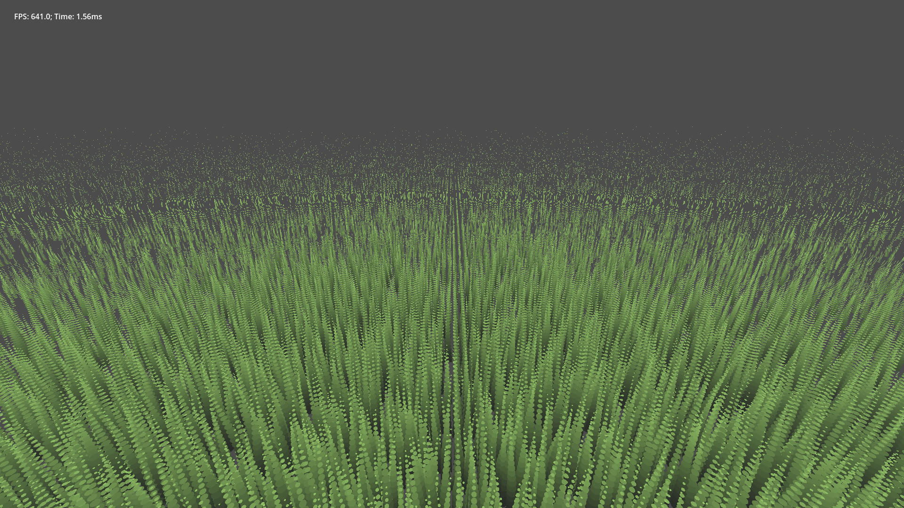

# godot-grass-shells
Small repository with a basic grass shell texturing implementation, made with Godot 4.1.1.

The shader contains one variable for the amount of rendered shells, and one for the amount of march steps.

There is also `auto_grass_shell.gd` and `grass_shell_layer_cuboids.gdshader`, which provide a crude way to automatically create single layer shells from a mesh automatically.

## March vs Parallax

Both run at the same speed. The screenshots show the marcher at 30 steps.

The march steps approach doesn't work very well. I recommend using just the parallax.

